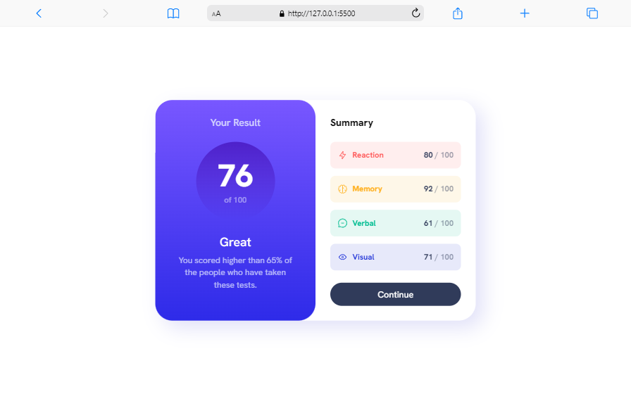
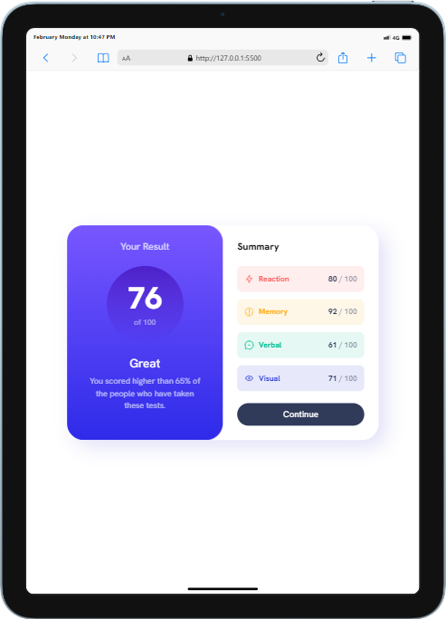
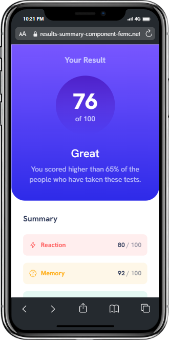

# Frontend Mentor - Results summary component solution

This is a solution to the [Results summary component challenge on Frontend Mentor](https://www.frontendmentor.io/challenges/results-summary-component-CE_K6s0maV).

## Table of contents

- [Overview](#overview)
  - [The challenge](#the-challenge)
  - [Screenshot](#screenshot)
  - [Links](#links)
- [My process](#my-process)
  - [Built with](#built-with)
  - [What I learned](#what-i-learned)
  - [Continued development](#continued-development)
  - [Useful resources](#useful-resources)
- [Author](#author)

## Overview

### The challenge

Users should be able to:

- View the optimal layout for the interface depending on their device's screen size
- See hover and focus states for all interactive elements on the page

### Screenshot






### Links

- Solution URL: [Click here](https://www.frontendmentor.io/solutions/responsive-results-summary-component-E_7LwSUhmz)
- Live Site URL: [Click here](https://github.com/xyzeez/Results-summary-component)

## My process

### Built with

- Semantic HTML5 markup
- Flexbox
- CSS Grid
- Mobile-first workflow


### What I learned

In this project, I was able to practice gradient color pattern and also the use of ```hsla``` to reduce the color opacity.

### Continued development

This project entails the JSON file and I'd like to implement that with Javascript in the future.

### Useful resources

- [Box Shadow CSS Generator](https://cssgenerator.org/box-shadow-css-generator.html) - This helped me to generate the box shadow use on the ```main``` section.


## Author

- Frontend Mentor - [@xyzeez](https://www.frontendmentor.io/profile/xyzeez)
- Twitter - [@abdusamii_](https://twitter.com/abdusamii_)